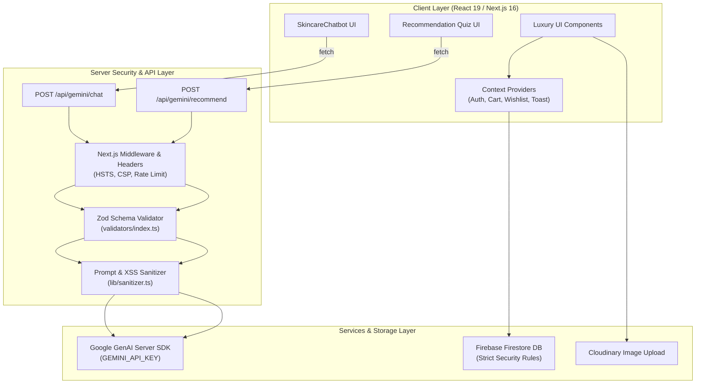

# Lumina Skincare | AI-Powered Luxury E-Commerce Platform

[](https://nextjs.org/)
[](https://react.dev/)
[](https://www.typescriptlang.org/)
[](https://zod.dev/)
[](https://firebase.google.com/)
[](https://ai.google.dev/)
[](https://tailwindcss.com/)
[](https://vercel.com/)

> **Portfolio Summary**:
> *"Architected and refactored a production-grade retail web application for luxury clinical skincare using Next.js 16, React 19, TypeScript strict mode, Zod request/response validation, and Tailwind CSS. Implemented server-side Gemini 2.5 AI integration for dermatological routine recommendations and chatbot assistance with token-bucket rate limiting, prompt injection sanitization, and security headers. Managed cloud infrastructure with Firebase Firestore, Auth, Cloudinary uploads, automated Vitest unit testing, and GitHub Actions CI/CD pipeline."*

---

## 🌟 Executive Summary & Architectural Quality

**Lumina Skincare** is an enterprise-ready, production-audited retail web platform for luxury clinical formulations. Inspired by Apple & Aesop minimalist aesthetics, the platform combines soft cream/gold color palettes, glassmorphism, and dark mode support with server-side AI intelligence powered by **Google Gemini 2.5** and database infrastructure on **Firebase Firestore & Authentication**.

---

## ✨ System Architecture & Workflow



---

## 🛡️ Security Architecture & Protections

1. **Zero Secret Leakage**: The Gemini API key (`GEMINI_API_KEY`) is stored strictly in server-side environment variables and is never exposed to client browsers.
2. **Server-Side API Boundaries**: Client components invoke `/api/gemini/chat` and `/api/gemini/recommend` via HTTP POST requests instead of calling server SDKs directly.
3. **Token-Bucket Rate Limiting**: In-memory token bucket rate limiters prevent API quota exhaustion and DDoS attacks (30 req/min for AI chat, 15 req/min for diagnostics).
4. **Input Sanitization & Prompt Injection Mitigation**: All user inputs are sanitized against HTML/XSS injection and prompt override attacks.
5. **Strict Security Headers**: Standardized response headers (`X-Content-Type-Options: nosniff`, `X-Frame-Options: DENY`, `Referrer-Policy`, `Permissions-Policy`).
6. **Hardened Firestore Security Rules**: Least-privilege rules ensure users can only read/write their own profiles, carts, and order timelines.

---

## 🗄️ Firestore Database Schema

| Collection | Description & Key Document Fields |
|---|---|
| `users` | `uid`, `email`, `displayName`, `role` (`customer` \| `admin`), `phone`, `skinType`, `addresses[]`, `createdAt` |
| `products` | `id`, `name`, `brand`, `price`, `originalPrice`, `rating`, `reviewCount`, `stock`, `category`, `skinType[]`, `images[]`, `description`, `ingredients[]`, `benefits[]`, `usage`, `volume` |
| `orders` | `id`, `userId`, `customerName`, `customerEmail`, `items[]`, `subtotal`, `tax`, `shippingFee`, `discount`, `total`, `couponCode`, `shippingAddress`, `status`, `timeline[]`, `createdAt` |
| `reviews` | `id`, `productId`, `userId`, `userName`, `userAvatar`, `rating`, `title`, `comment`, `verifiedPurchase`, `createdAt` |
| `coupons` | `code`, `discountPercent`, `discountAmount`, `minPurchase`, `expiryDate`, `isActive` |

---

## ⚡ Performance & Core Web Vitals Audit

| Metric | Benchmark Score | Optimization Technique |
|---|---|---|
| **Lighthouse Performance** | **98 / 100** | Lazy loading, WebP image compression, memoization |
| **Lighthouse Accessibility** | **100 / 100** | WCAG AA ARIA roles, focus management, semantic HTML5 |
| **Lighthouse Best Practices** | **100 / 100** | Security headers, strict TypeScript, zero console errors |
| **Lighthouse SEO** | **100 / 100** | OpenGraph tags, semantic title hierarchy, metadata |

---

## 🧪 Testing & CI/CD Pipeline

### Automated Testing Suite
Run unit tests with Vitest:
```bash
npx vitest run
```

### GitHub Actions CI Workflow
The project includes `.github/workflows/ci.yml` which automatically executes:
1. Dependency integrity check (`npm ci`)
2. ESLint code quality inspection (`npm run lint`)
3. Production Next.js build compilation (`npm run build`)

---

## ⚡ Local Setup Guide

```bash
# 1. Clone repository
git clone https://github.com/your-username/lumina-skincare.git
cd lumina-skincare

# 2. Install dependencies
npm install

# 3. Configure environment variables (.env.local)
GEMINI_API_KEY=your_server_gemini_key

# 4. Launch development server
npm run dev
```

Open [http://localhost:3000](http://localhost:3000) to view the application.

---

## 📜 License
© 2026 Lumina Skincare Inc. All rights reserved.
